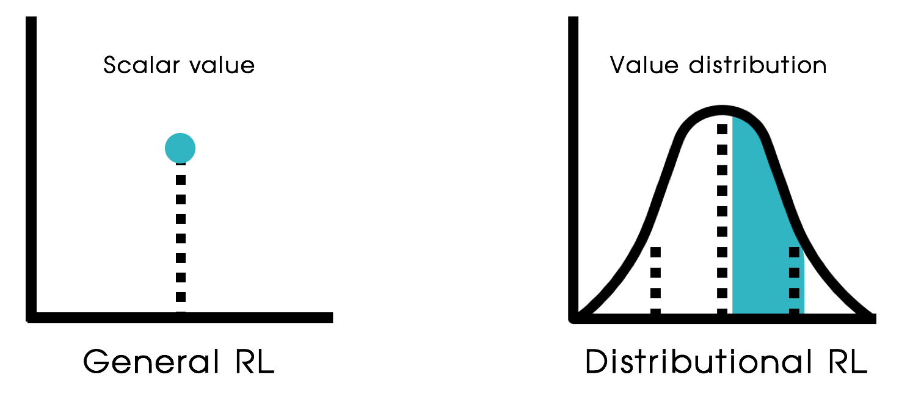
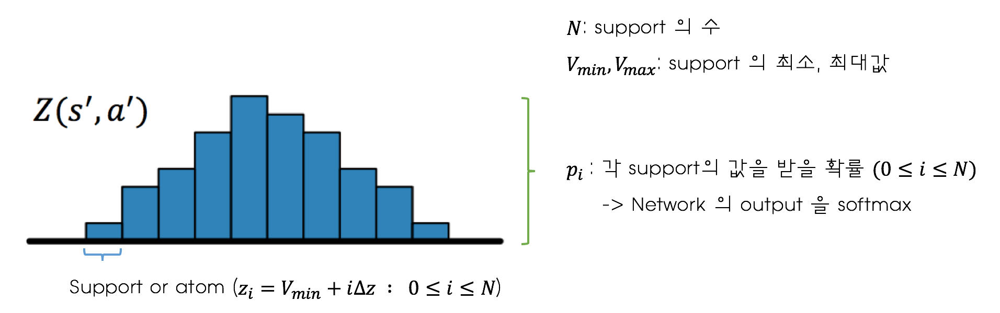
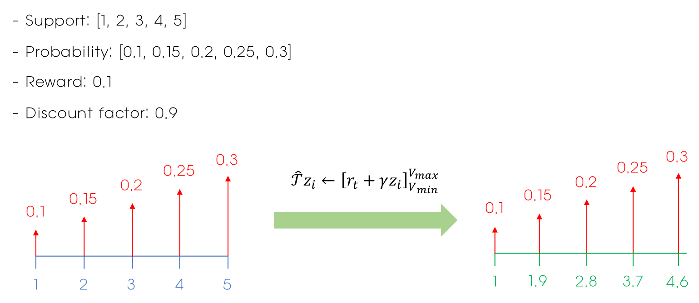
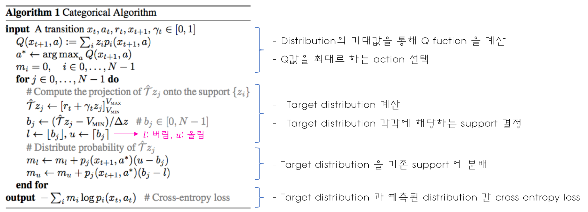
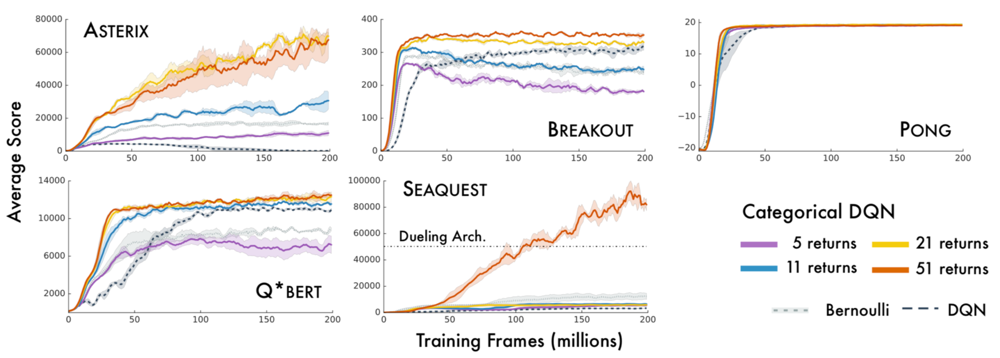
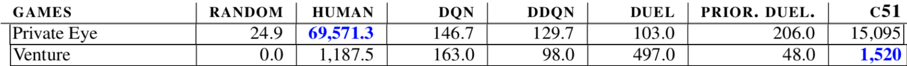
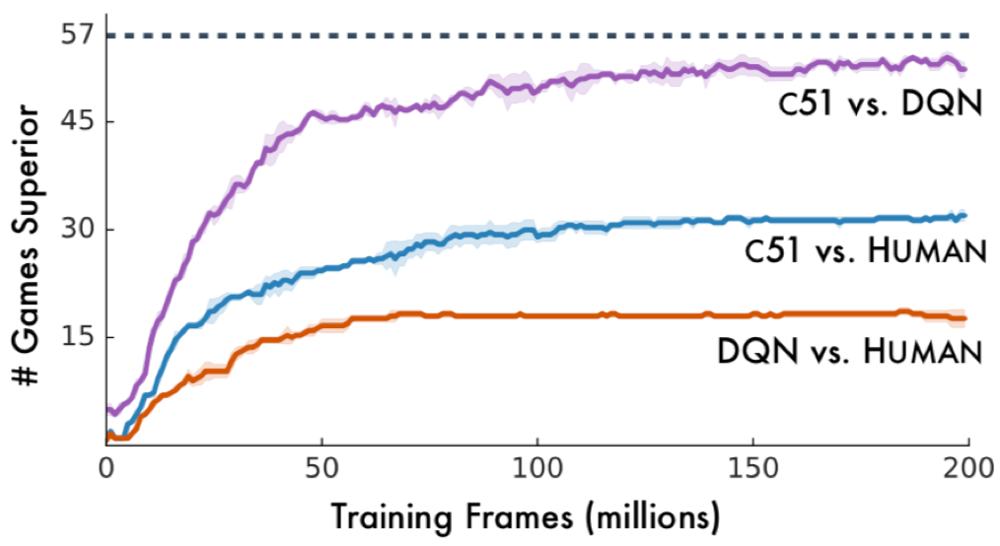

# C51
#### 먼저 읽어주세요!

[Distributional Reinforcement Learning](https://reinforcement-learning-kr.github.io/2018/09/27/Distributional_intro/)

#### 알고리즘 구현!

[Github Repo](https://github.com/reinforcement-learning-kr/distributional_rl/tree/master/1_CartPole_C51)

 

## Introduction

본 게시물은 2017년에 발표된 논문 [A Distributional Perspective on Reinforcement Learning](https://arxiv.org/abs/1707.06887) 의 내용에 대해 설명합니다.

 

Distributional RL에 대해 설명한 게시물에서도 언급했듯이 distributional RL 알고리즘은 value를 하나의 scalar 값이 아닌 distribution으로 예측합니다.

 이에 따라 일반적인 강화학습에서 이용하는 `bellman equation`의 value Q 대신 distribution Z를 사용합니다. 이 bellman equation을 `distributional bellman equation` 이라고 합니다. 해당 식들은 다음과 같습니다. 

 

 

이에 따라 network의 output도 각 알고리즘에 따라 차이가 있습니다. 

[DQN](https://deepmind.com/research/publications/human-level-control-through-deep-reinforcement-learning/)에서 network의 output이 각 action에 대한 Q-value였다면 distributional RL에서 network의 output은 아래 그림과 같이 각 action에 대한 value distribution 입니다. 

 

 

## Value Distribution

Action에 대한 Distribution에 대해서 살펴보도록 하겠습니다. 

 

Network의 output은 위와 같은 이산 확률분포(Discrete Probability Distribution) 입니다. 여기서 가로축은 **Support** 혹은 **atom**이라고 부르며 value값을 나타냅니다. 세로축은 확률을 나타냅니다. 즉, 이 분포는 각각의 value와 그 value를 받을 확률을 나타내는 분포입니다.

C51의 경우 분포를 결정해주기 위해서 몇가지 파라미터들이 필요합니다. 해당 파라미터들은 다음과 같습니다.

- Support의 수
- Support의 최대값
- Support의 최소값

위 그림에서도 볼 수 있듯이 support값은 최소값부터 최대값까지 support의 수에 맞게 일정한 간격으로 나누게 됩니다. 즉, supports는 이렇게 미리 결정된 파라미터들에 의해 그 값이 정해지게 됩니다. 네트워크는 바로 이 support들에 대한 확률을 구해주게 됩니다. 각 action에 대해서 하나의 distribution이 필요하기 때문에 **network output의 크기는 [support의 수 * action의 수]** 가 됩니다.  

 

## Algorithm

알고리즘의 진행은 DQN과 거의 동일합니다. `Experience Replay` 나 `Target Network`  같은 기법도 그대로 이용합니다. 차이점은 아래 3가지 정도입니다. 

1. Q-value 계산
2. Loss
3. Target distribution 구하기

각각 어떻게 차이가 있는지 한번 살펴보도록 하겠습니다. 

 

### 1. Q-value 계산

C51 알고리즘에서 Q-value를 계산하는 방법은 이산확률분포의 기대값을 구하는 것입니다. 이에 따라 각 action에 대한 Q-value를 계산하는 식은 다음과 같습니다. 

 

 수식에서 사용된 각 기호는 위에 있는 Value distribution 그림을 참고해주세요! 각 action의 distribution마다 위의 식에 따라 연산을 수행하고 최대의 Q-value를 가지는 action을 선택하면 됩니다. 

 위 수식처럼 분포의 기대값을 구하는 연산을 하면 결과적으로 Q-value는 하나의 scalar값을 가지게 됩니다. 이 경우 "뭐지... 결국 scalar값으로 action 선택하자나..." 라고 생각하실수도 있지만!! 단순히 하나의 기대값을 추정하는 것보다 정확하게 분포를 추정하고 그 기대값을 구하는 것이 더 정확한 예측이 될 것이라 생각할 수 있습니다. 

 

### 2. Loss 구하기 

 Distributional RL의 경우 정확한 분포를 예측하는 것이 목적입니다. 이에 따라 target value가 아닌 target distribution을 통해 학습을 수행합니다. Target distribution과 추정된 distribution간의 차이를 줄이는 방향으로 학습을 수행해야 할텐데! 그럼 distribution간의 차이는 어떻게 구할까요? 본 논문에서는 [Cross Entropy](https://en.wikipedia.org/wiki/Cross_entropy) 를 이용합니다. 그 식은 다음과 같습니다. 

 

마지막으로 위의 식에 필요한 target distribution을 구하는 과정에 대해 살펴보도록 하겠습니다. 

 

### 3. Target Distribution

Target distribution을 만드는 이 과정이 C51 알고리즘의 구현에 있어 가장 귀찮고 까다로운 부분입니다. 우선 target distribution을 만들기 위해서 우선 value값과 직접적으로 연관이 있는 support에 대한 연산을 수행합니다. 해당 연산은 DQN에서 target value를 구하는 식과 같습니다. 

 

Target distribution의 경우 supports에 대해 위와 같은 연산을 해줍니다. 각 support에 discount factor를 곱하고 reward를 더해줍니다. (단, terminal이 false일 때, 즉 게임이 끝나지 않은 경우에만 이렇게 연산을 하고 게임이 끝난 경우에는 모든 support 값들을 reward 값으로 사용합니다 -> supports = [r_t]) 이 값은 support의 최대값보다 큰 경우 최대값과 같도록, 최소값보다 작은 경우 최소값과 같도록 설정해줍니다. 

그런데 이 경우에 문제가 생길 수 있습니다! 예를 들어 supports가 [1, 2, 3, 4, 5] 인 경우 reward = 0.1, discount factor = 0.9라고 해보겠습니다. 이 경우 위의 식에 따라 연산을 해주면 supports가 [1, 1.9, 2.8, 3.7, 4.6]이 됩니다. Loss인 cross entropy 연산을 하기 위해서는 두 distribution의 supports가 일치해야되는데 support가 달라져 버렸습니다! 이 경우 때문에 target distribution의 support를 원래의 support와 같이 분배해주는 **Projection** 이라는 과정이 추가적으로 필요합니다! 

위의 과정을 그림으로 표현한 것이 다음과 같습니다. 

 

 Projection의 경우 다음의 예시를 통해 설명을 하도록 하겠습니다. 

아래와 같은 상황이 있다고 해보겠습니다. 

 

변경된  support가 3.7인 경우를 예시로 하여 Projection을 해보도록 하겠습니다. 이 경우 3.7에 해당하는 확률값인 0.25를 support 3과 4로부터의 거리에 비례하여 분배합니다. 그 과정이 아래 그림과 같습니다. 

 

위와 같이 3.7은 기존의 support 3과 4 사이에 존재하는 값입니다. 3.7이 가진 확률값 0.25를 3과 4에 분배해야합니다. 이때 거리를 기반으로 값을 분배합니다. 3.7은 3보다는 4에 더 가깝죠. 그렇기 때문에 4에 더 많은 비율을 분배해줘야 합니다. 3과 4에서부터 3.7까지 거리의 비율은 각각 7:3 입니다. 이 3:7의 비율 중 3을 support값 3에, 7을 support값 4에 분배해줍니다. 그렇기 때문에 support 3의 확률값은 0.25 * 0.3 = 0.075을, support 4의 확률값은 0.25 * 0.7 = 0.175를 각각 할당받게 됩니다. 이 과정을 위의 예시에서 모든 supports에 적용한 결과가 다음과 같습니다. 

 

위와 같이 supports [1, 1.9, 2.8, 3.7, 4.6] 일때 확률값이 [0.1, 0.15, 0.2, 0.25, 0.3] 였던 것이 **Projection** 과정 이후에는 supports [1, 2, 3, 4, 5] 이고 각각에 대한 확률값이 [0.115, 0.175, 0.235, 0.295, 0.18]이 되었습니다. 이것이 최종적으로 구한 target distribution이며 이제 Projection을 통해 supports가 기존의 supports와 같아졌기 때문에 **Cross entropy** 연산이 가능하게 되었습니다!! 

여기까지가 Projection을 수행하는 과정입니다. 

 

지금까지의 과정을 잘 이해하셨다면 논문에 나온 아래의 알고리즘을 더 수월하게 이해할 수 있을 것입니다. 

 

 

## Result

본 알고리즘의 성능은 Atari 환경에서 검증되었으며 이때 사용한 parameters는 다음과 같습니다. 

- V(max) = 10 -> support의 최대값
- V(min) = -10 -> support의 최소값
- Epsilon (Adam) = 0.01 / (batch size) -> Adam optimizer의 epsilon 값
- Learning rate = 0.00025
- Batch size = 32

Atari 환경에서 테스트한 결과는 다음과 같습니다. 

 

위의 결과에서 볼 수 있듯이 support의 수가 많아질수록 성능은 좋아지는 편입니다. 특히 51개의 support를 이용했을 때 `SeaQuest` 게임에서 아주 좋은 성능을 보입니다. 그래서 일반적으로 이 알고리즘에서는 51개의 support를 이용하며 이에 따라 **C51**이라고 알고리즘을 부르게 되었습니다. 

 

위에서 볼 수 있듯이 sparse한 reward 환경인 Private Eye나 Venture 같은 게임에서도 다른 알고리즘들에 비해 좋은 결과를 보였다고 합니다. 

 

또한 위에서 볼 수 있듯이 DQN, DDQN, Dueling, PER, PER + Dueling 과 비교했을 때에도 매우 좋은 성능을 보입니다. 

 

마지막으로 위의 결과는 C51 vs DQN, C51 vs Human, DQN vs Human 을 했을 때 더 좋은 성능을 보인 게임의 수 입니다. 총 57개의 게임이 있으니 C51의 경우 약 절반 이상의 게임에서 사람보다 우수한 성능을 보인 알고리즘이라 할 수 있습니다. 

 

## Conclusion

C51의 경우 distributional RL 3형제 중 첫번째 알고리즘으로 distribution을 통해 value를 예측하는 알고리즘입니다. Distribution을 이용하여 value를 잘 예측하며 좋은 성능을 보이지만 이 알고리즘에서는 몇가지 아쉬운 점이 있습니다. 

1.  support에 관련된 파라미터들을 결정해줘야하며 게임의 reward 범위에 따라 이 값들을 따로 설정해야 할 수 있습니다. 이런 점에 조금 귀찮은 점이 있습니다. 
2. 알고리즘에 굉장히 번거로운 projection 과정이 포함되어 있습니다. 
3. 마지막으로 해당 알고리즘의 경우 수학적으로 수렴성을 보장하지 못하는 알고리즘입니다. 

 

Distributional RL이 수렴하기 위해서는 위와 같은 gamma-contraction 조건을 만족해야합니다. value distribution간 거리를 측정하는 distance metric (d_p)가 **Wasserstein distance**인 경우 위 조건을 **만족**하지만 **Cross entropy** 의 경우 수학적으로 위의 조건을 만족한다는 보장이 없다고 합니다. 하지만 C51 논문은 wasserstein distance를 감소시킬 방법을 찾지 못한 관계로 Cross entropy를 loss로 설정하고 이를 줄이는 방향으로 학습을 수행하는 알고리즘이기 때문에 수학적으로 distributional RL의 수렴성을 증명하지는 못하는 논문입니다. 

 

이 위의 3가지 문제점들을 해결한 논문이 C51의 후속으로 발표된 [Distributional Reinforcement Learning with Quantile Regression (QR-DQN)](https://arxiv.org/abs/1710.10044) 논문입니다. 다음 게시물에서는 이 QR-DQN 논문의 내용에 대해 살펴보도록 하겠습니다!! :smile:

 

## Reference

- [A Distributional Perspective on Reinforcement Learning](https://arxiv.org/abs/1707.06887)
- [Blog: Distributional Bellman and the C51 Algorithm](https://flyyufelix.github.io/2017/10/24/distributional-bellman.html)
- [Blog: Distributional RL](https://mtomassoli.github.io/2017/12/08/distributional_rl/) 
- [Deepmind Blog: Going beyond average for reinforcement learning](https://deepmind.com/blog/going-beyond-average-reinforcement-learning/)

 

## Team

민규식: [Github](https://github.com/Kyushik), [Facebook](https://www.facebook.com/kyushik.min)

차금강: [Github](https://github.com/chagmgang), [Facebook](https://www.facebook.com/profile.php?id=100002147815509)

윤승제: [Github](https://github.com/sjYoondeltar), [Facebook](https://www.facebook.com/seungje.yoon)

김하영: [Github](https://github.com/hayoung-kim), [Facebook](https://www.facebook.com/altairyoung)

김정대: [Github](https://github.com/kekmodel), [Facebook](https://www.facebook.com/kekmodel)

