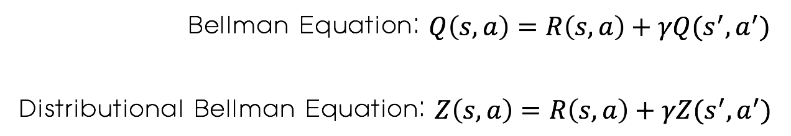

# C51
#### 먼저 읽어주세요!

[Distributional Reinforcement Learning]()

#### 알고리즘 구현!

[Github Repo](https://github.com/reinforcement-learning-kr/distributional_rl/tree/master/1_CartPole_C51)

## Introduction

본 파일은 2017년에 발표된 논문 [A Distributional Perspective on Reinforcement Learning](https://arxiv.org/abs/1707.06887) 의 내용에 대해 설명하는 논문입니다.

 

Distributional RL에 대해 설명한 게시물에서도 언급했듯이 distributional RL 알고리즘은 value를 하나의 scalar 값이 아닌 distribution으로 예측합니다.

 이에 따라 일반적인 강화학습에서 이용하는 `bellman equation`의 value Q 대신 distribution Z를 사용합니다. 이 bellman equation을 `distributional bellman equation` 이라고 합니다. 해당 식들은 다음과 같습니다. 

 

 

이에 따라 network의 output도 각 알고리즘에 따라 차이가 있습니다. 

[DQN](https://deepmind.com/research/publications/human-level-control-through-deep-reinforcement-learning/)에서 network의 output이 각 action에 대한 Q-value였다면 distributional RL에서 network의 output은 아래 그림과 같이 각 action에 대한 value distribution 입니다. 

 

## Value Distribution

Action에 대한 Distribution에 대해서 살펴보도록 하겠습니다. 

 

Network의 output은 위와 같은 이산 확률분포(Discrete Probability Distribution) 입니다. 여기서 가로축은 **Support** 혹은 **atom**이라고 부르며 value값을 나타냅니다. 세로축은 확률을 나타냅니다. 즉, 이 분포는 각각의 value와 그 value를 받을 확률을 나타내는 분포입니다.

C51의 경우 분포를 결정해주기 위해서 몇가지 파라미터들이 필요합니다. 해당 파라미터들은 다음과 같습니다.

- Support의 수
- Support의 최대값
- Support의 최소값

위 그림에서도 볼 수 있듯이 support값은 최소값부터 최대값까지 support의 수에 맞게 일정한 간격으로 나누게 됩니다. 즉, supports는 이렇게 미리 결정된 파라미터들에 의해 그 값이 정해지게 됩니다. 네트워크는 바로 이 support들에 대한 확률을 구해주게 됩니다. 각 action에 대해서 하나의 distribution이 필요하기 때문에 **network output의 크기는 [support의 수 * action의 수]** 가 됩니다.  

## Algorithm

알고리즘의 진행은 DQN과 거의 동일합니다. `Experience Replay` 나 `Target Network`  같은 기법도 그대로 이용합니다. 차이점은 아래 3가지 정도입니다. 

1. Q-value 계산
2. Loss
3. Target distribution 구하기

각각 어떻게 차이가 있는지 한번 살펴보도록 하겠습니다. 

### 1. Q-value 계산

C51 알고리즘에서 Q-value를 계산하는 방법은 이산확률분포의 기대값을 구하는 것입니다. 이에 따라 각 action에 대한 Q-value를 계산하는 식은 다음과 같습니다. 

 

 수식에서 사용된 각 기호는 위에 있는 Value distribution 그림을 참고해주세요! 각 action의 distribution마다 위의 식에 따라 연산을 수행하고 최대의 Q-value를 가지는 action을 선택하면 됩니다. 

 위 수식처럼 분포의 기대값을 구하는 연산을 하면 결과적으로 Q-value는 하나의 scalar값을 가지게 됩니다. 이 경우 "뭐지... 결국 scalar값으로 action 선택하자나..." 라고 생각하실수도 있지만!! 단순히 하나의 기대값을 추정하는 것보다 정확하게 분포를 추정하고 그 기대값을 구하는 것이 더 정확한 예측이 될 것이라 생각할 수 있습니다. 

### 2. Loss 구하기 

 Distributional RL의 경우 정확한 분포를 예측하는 것이 목적입니다. 이에 따라 target value가 아닌 target distribution을 통해 학습을 수행합니다. Target distribution과 추정된 distribution간의 차이를 줄이는 방향으로 학습을 수행해야 할텐데! 그럼 distribution간의 차이는 어떻게 구할까요? 본 논문에서는 [Cross Entropy](https://en.wikipedia.org/wiki/Cross_entropy) 를 이용합니다. 그 식은 다음과 같습니다. 

 

마지막으로 위의 식에 필요한 target distribution을 구하는 과정에 대해 살펴보도록 하겠습니다. 

### 3. Target Distribution

Target distribution을 만드는 이 과정이 C51 알고리즘의 구현에 있어 가장 귀찮고 까다로운 부분입니다. 우선 target distribution을 만들기 위해서 우선 value값과 직접적으로 연관이 있는 support에 대한 연산을 수행합니다. 해당 연산은 DQN에서 target value를 구하는 식과 같습니다. 

 

Target distribution의 경우 supports에 대해 위와 같은 연산을 해줍니다. 각 support에 discount factor를 곱하고 reward를 더해줍니다. 이 값은 support의 최대값보다 큰 경우 최대값과 같도록, 최소값보다 작은 경우 최소값과 같도록 설정해줍니다. 

그런데 이 경우에 문제가 생길 수 있습니다! 예를 들어 supports가 [1, 2, 3, 4, 5] 인 경우 reward = 0.1, discount factor = 0.9라고 해보겠습니다. 이 경우 위의 식에 따라 연산을 해주면 supports가 [1, 1.9, 2.8, 3.7, 4.6]이 됩니다. Loss인 cross entropy 연산을 하기 위해서는 두 distribution의 supports가 일치해야되는데 support가 달라져 버렸습니다! 이 경우 때문에 **Projection** 이라는 과정이 필요합니다! 

위의 과정을 그림으로 표현한 것이 다음과 같습니다. 

 

 Projection의 경우 다음의 예시를 통해 설명을 하도록 하겠습니다. 

