# QR-DQN
#### 먼저 읽어주세요!

[Distributional Reinforcement Learning](https://reinforcement-learning-kr.github.io/2018/09/27/Distributional_intro/)

[C51](https://reinforcement-learning-kr.github.io/2018/10/02/C51/)

#### 알고리즘 구현!

[Github Repo](https://github.com/reinforcement-learning-kr/distributional_rl/tree/master/2_CartPole_QR-DQN)

 

## Introduction

본 게시물은 2017년 10월에 발표된 논문 [Distributional Reinforcement Learning with Quantile Regression(QR-DQN)](https://arxiv.org/abs/1710.10044) 의 내용에 대해 설명합니다.

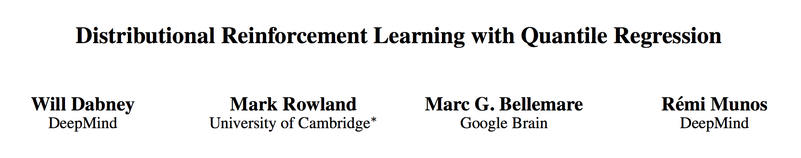

 

 

## Algorithm 

QR-DQN의 경우 C51과 비교했을 때 다음의 내용들에서 차이를 가집니다. 

- Network의 Output
- Loss

위와 같이 사실상 별로 다른 점은 없습니다. 위의 내용들에 대해 하나하나 살펴보도록 하겠습니다. 

 

### 1. Network의 Output

이 파트에서는 QR-DQN이 output으로 어떤 값들을 추정하는지 알아봅니다. 왜 Quantile regression을 이용하는지, 이를 이용하면 어떻게 Wasserstein distance를 줄일 수 있고 이에 따라 distributional RL의 수렴성을 증명하게 되는지, 어떤 quantile을 이용해서 Wasserstein distance를 최소화 할 수 있는지 알아보도록 하겠습니다. 

 

#### C51 vs QR-DQN

 QR-DQN의 경우도 C51과 같이 distributional RL 알고리즘입니다. 이에 따라 QR-DQN에서도 network의 output은 각 action에 대한 value distribution 입니다. C51 게시물에서 value distribution을 구성하는 것은 아래 그림과 같이 **support**와 해당 support의 **확률**, 2가지였습니다. 

 

QR-DQN과 C51의 경우 output을 구하는데 차이가 있습니다. 해당 차이를 그림으로 나타낸 것이 다음과 같습니다. 

 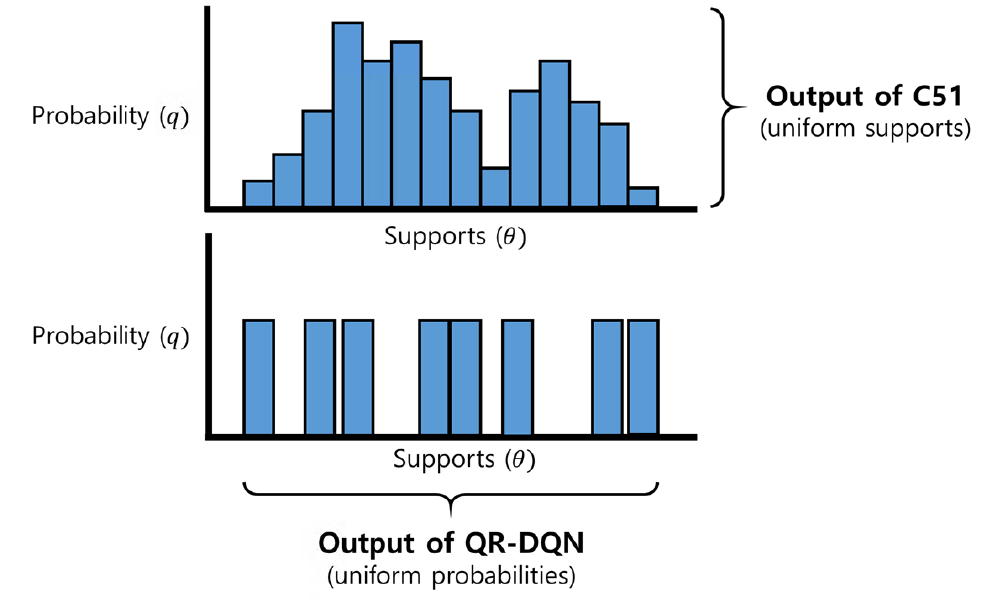

즉 다음과 같은 차이가 있습니다. 

- C51: support를 동일한 간격으로 고정, network의 output으로 확률을 구함 
- QR-DQN: 확률을 동일하게 설정, network의 output으로 support를 구함 

C51의 경우 support를 구하기 위해서 다음의 parameter들을 결정해줘야 했습니다. 

- Support의 수
- Support의 최대값
- Support의 최소값

하지만 QR-DQN의 경우 network가 바로 supports를 구하기 때문에 support의 최대값이나 최소값은 정해줄 필요가 없습니다. 이에 따라 QR-DQN은 support의 수만 추가적인 parameter로 결정해주면 됩니다. QR-DQN에서 확률은 모두 동일하게 결정해주기 때문에 (1/support의 수) 로 단순하게 결정해주면 됩니다. 

#### Quantile Regression

 그럼 QR-DQN은 왜 확률은 고정하고 network를 통해 supports를 선택하는 방법을 취할까요?? 단순히 support와 관련된 parameter들의 수를 줄이기 위함은 아닙니다! 바로 QR-DQN은 **Quantile Regression**이라는 기법을 사용하기 때문입니다. Quantile regression이 무엇인지, 왜 사용하는지 한번 알아보도록 하겠습니다. 

그럼 일단 **Quantile**이 무엇인지부터 알아보겠습니다. 우선 논문에서 사용된 Quantile은 확률분포는 몇 등분 했는가를 나타냅니다. 예를 들어 4-quantiles 라고 하면 아래와 같이 확률분포를 25%씩 4등분 하게 되는 것입니다. 그리고 이때 quantile의 값들은 [0.25, 0.5, 0.75, 1]이 됩니다. 

 

 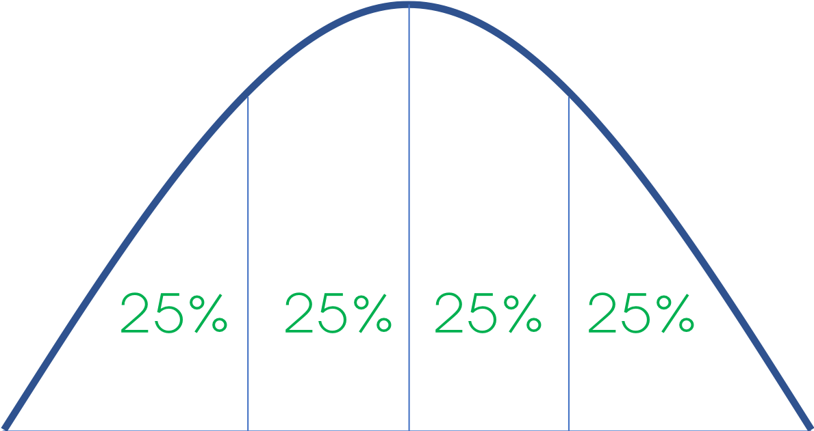

 Quantile regression은 [Cumulative Distribution Function (CDF)](https://en.wikipedia.org/wiki/Cumulative_distribution_function)에서 적용하는 알고리즘이므로 Quantile의 예시를 CDF로 나타낸 결과가 다음과 같습니다. 

 

 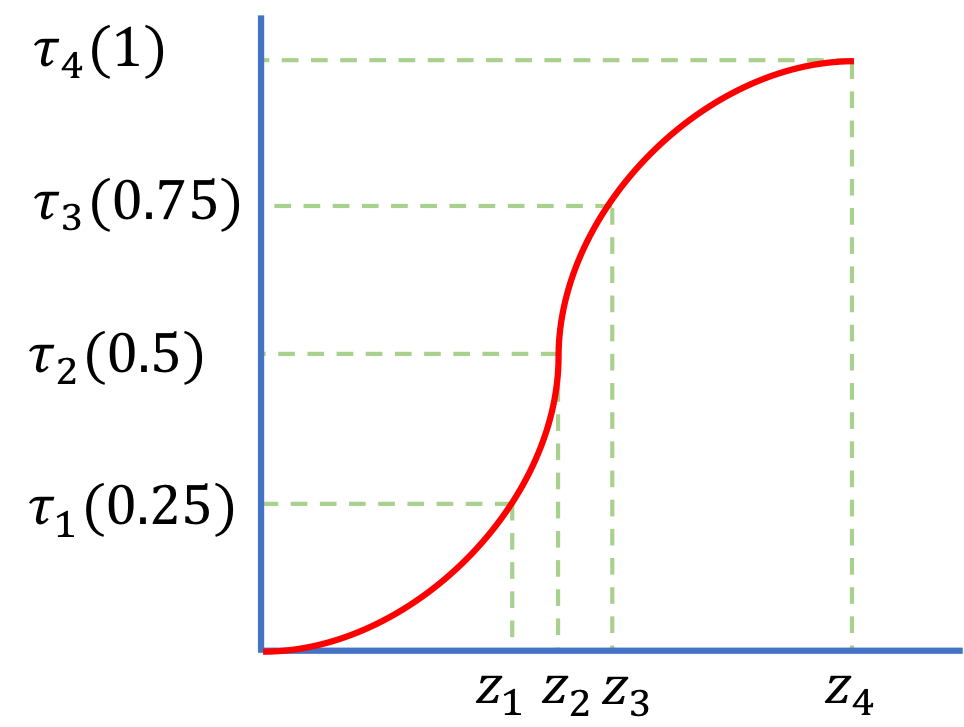

CDF의 함수를 F, distribution function을 Z라고 했을 때 다음과 같이 식을 표시합니다. 

 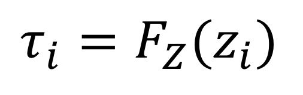

Quantile regression은 모든 quantile에 대한 CDF의 역함수입니다. 그렇기 때문에 위의 식을 다음과 같이 역함수의 형태로 나타낼 수 있습니다. 

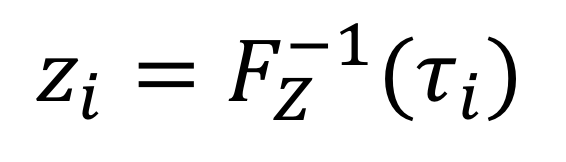

즉 Quantile regression은 동일하게 나눈 확률들을 input으로 하여 각각의 support를 구하는 것입니다. 그럼 왜 본 논문에서는 quantile regression을 통해 구한 support들간의 차이를 줄이는 방향으로 학습을 수행할까요? 이것은 **Wasserstein Distance**와 관련이 있습니다. 

 

#### Wasserstein Distance

C51논문에서 언급하였듯이 Distributional RL은 다음의 contraction 조건을 만족할 때 알고리즘의 수렴성을 보장합니다. 

 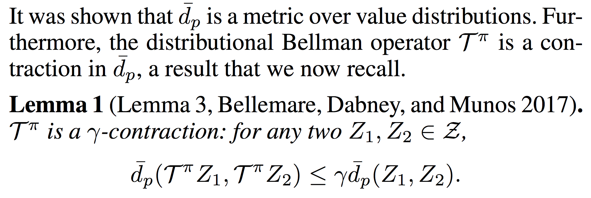

이때 distribution간의 거리를 나타내는 d_p가 Wasserstein distance일때는 수학적으로 위의 조건을 만족하지만 C51은 cross entropy를 이용했기 때문에 수학적으로 위의 조건을 만족한다는 것을 증명할 수 없었습니다. 

p-Wasserstein distance의 식은 아래와 같습니다. 

 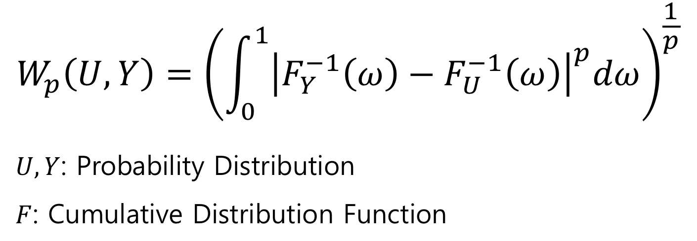

 

위의 식에서 볼 수 있듯이 p-Wasserstein distance는 CDF의 역함수의 L^p metric입니다. 본 논문에서는 1-Wasserstein distance를 이용합니다. 1-Wasserstein distance는 두 확률분포에 대한 CDF의 역함수간의 차이입니다. 아래의 그래프는 [Distributional RL 블로그](https://mtomassoli.github.io/2017/12/08/distributional_rl/)에서 참고한 그래프입니다. 

 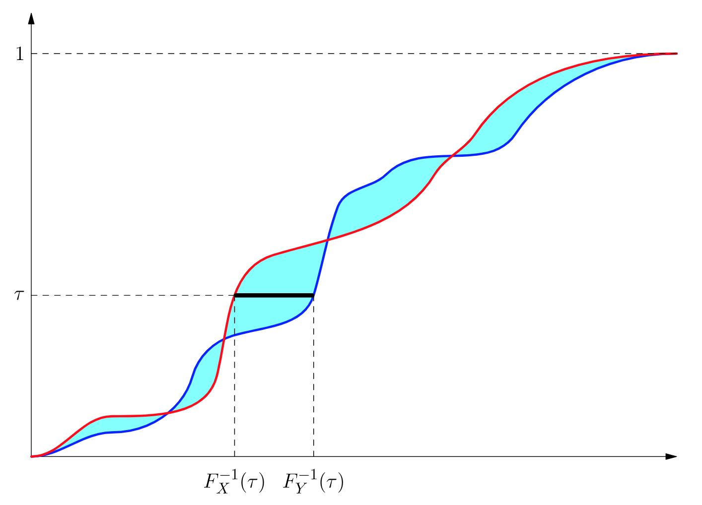

 

위의 graph에서 하늘색으로 된 부분이 1-Wasserstein distance를 나타냅니다. 이 부분은 두 확률 분포의 CDF의 역함수간 차이입니다. 그런데 아까 Quantile regression에 대해 이야기할 때 quantile regression의 정의가 바로 모든 quantile에 대한 CDF의 역함수였습니다. 즉 이 quantile regression을 통해 구한 support 간의 차이를 줄어들게 되면 wasserstein distance 또한 줄어들게 되는 것입니다. 본 논문에서는 quantile regression을 통해 구한 support를 이용하여 확률분포를 추정하고 이를 target distribution과 유사해지도록 학습을 수행합니다. 그렇기 때문에 본 논문의 방식을 이용하면 distribution간의 Wasserstein distance를 줄이는 방향으로 학습할 수 있는 것이고 이에 따라 contraction 조건을 만족하게 되어 수학적으로 distributional RL의 수렴성 또한 증명하게 되는 것입니다. 

#### Unique Minimizer

하지만 이 논문에서 quantile은 단순히 (1/quantile의 수)를 이용하지 않습니다. 바로 각 quantiles의 중간값인 **quantile midpoint**를 이용합니다. 

 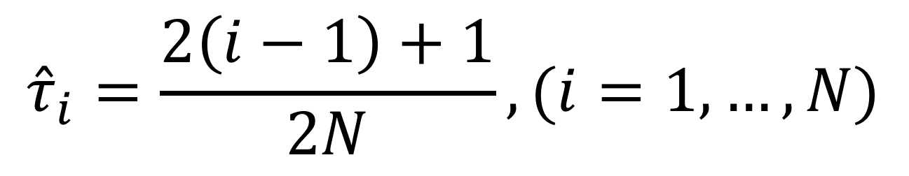

 

왜 이렇게 할까요? 바로 아래의 Lemma와 같이 두 확률 사이의 중간 지점이 해당 구간에서 Wasserstein distance를 최소로 하는 **unique minimizer**이기 때문입니다.

 

 

 

해당 내용을 그래프로 표현한 결과가 다음과 같습니다. 해당 내용은 [Distributional RL 블로그](https://mtomassoli.github.io/2017/12/08/distributional_rl/)의 내용을 참고하였습니다. 

 

 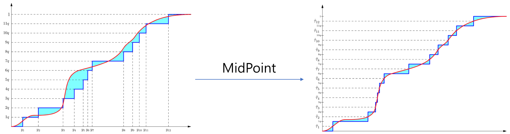

 

위의 그래프들을 통해 볼 수 있듯이 단순히 (1/Number of quantiles) 를 통해 구한 Wasserstein distance보다 해당 값들의 중간값들을 이용하여 구한 Wasserstein distance의 크기가 더 작은 것을 확인할 수 있습니다. 오른쪽 그래프에서 하늘색 영역이 많이 줄어든 것을 확인할 수 있습니다. 이에 따라 본 논문에서는 quantile regression을 적용할 때 **quantile midpoint**를 이용하여 그때의 support들을 추정합니다. 

 

이번 파트에서는 왜 QR-DQN이 C51과는 반대로 확률을 고정하고 support들을 추정하는지 살펴보았습니다. 다음 파트에서는 quantile regression 적용에 따라 사용되는 loss인 **Quantile Huber Loss**에 대해서 살펴보도록 하겠습니다. 

 

### 2. Quantile Huber Loss

이번 파트에서는 Quantile regression 사용에 따른 quantile regression loss와 여기에 Huber loss를 적용한 Quantile Huber loss에 대해서 살펴보도록 하겠습니다. 

 

#### Quantile Regression Loss

위에서 보셨듯이 QR-DQN은 Quantile Regression이라는 기법을 이용하여 value distribution을 정의합니다. 이에 따라 **Quantile Regression Loss**라는 특별한 loss를 이용하여 학습을 수행합니다. 우선 quantile regression loss의 목적은 다음의 2가지입니다. 

1.  Target value distribution과 네트워크를 통해 예측된 value distribution간 차이를 줄이도록 네트워크 학습 
2.  네트워크가 낮은 quantile에 대해서는 낮은 support값을, 높은 quantile에 대해서는 높은 support를 도출하도록 학습  

위의 상황에서 1의 경우 일반적인 loss의 목표입니다. Target distribution과 network를 통해 예측된 distribution간의 차이를 최소화 하도록 network를 학습시키는 것이죠. 하지만 2의 경우 quantile regression의 적용 때문에 필요한 부분입니다. 일단 2의 내용에 대해서 살펴보도록 하겠습니다. 

QR-DQN은 아래와 같이 CDF를 동일한 수의 quantile로 나누고 그때의 support를 찾는 기법입니다. 한번 예시를 들어보겠습니다. Quantile의 수가 4인 경우 중 tau=[0.25, 0.5, 0.75, 1]이 될 것이고 그 중앙값들은 [0.125, 0.375, 0.625, 0.875]가 될 것입니다. 중앙값들에 대해 network가 도출한 support들이 [1, 4, 5, 7]이라고 해보겠습니다. 위의 결과를 CDF로 나타낸 것이 아래의 그림과 같습니다. 

 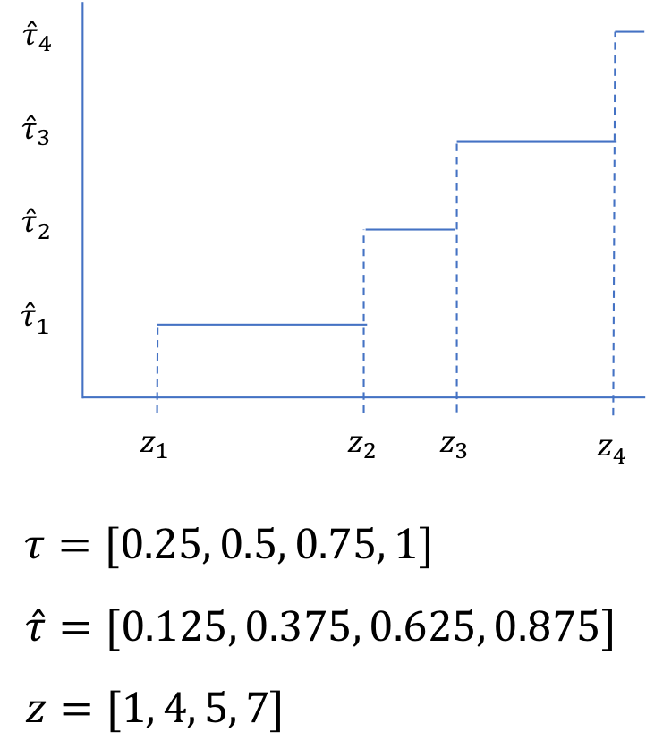

 위의 경우 정상적인 형태의 CDF입니다. 결과를 보면 tau의 중앙값 중 낮은 값들은 작은 값의 support를, 높은 값들은 큰 값의 support를 추정하여 cdf의 형태가 그 정의에 맞게 단조 증가하는 형태를 볼 수 있습니다. 

하지만 만약 위와 같은 상황에서 network가 도출한 support가 [1, **5**, **4**, 7] 이라고 생각해보겠습니다. 4와 5의 위치만 바뀌었죠? 이 결과를 CDF로 표현한 것이 아래와 같습니다. 

 

 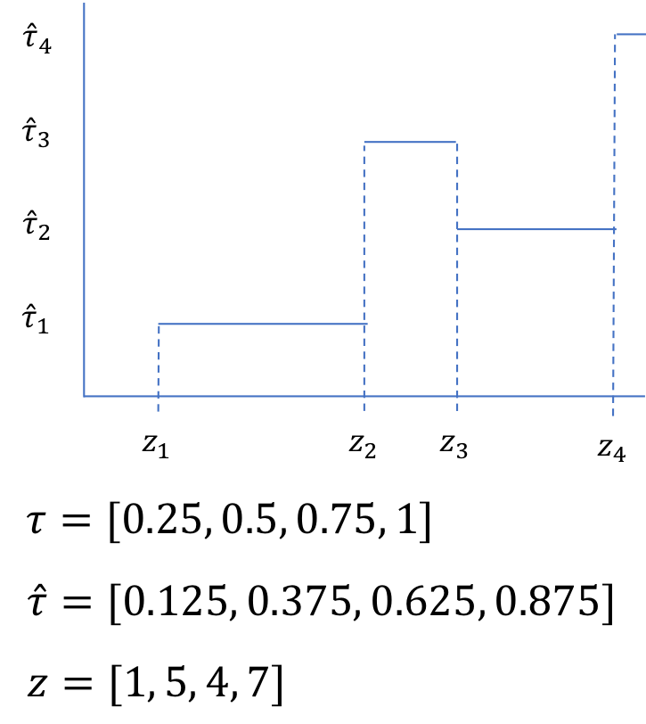

CDF는 확률변수 값에 따른 확률을 누적해서 더하기 때문에 확률변수 값이 커질수록 누적확률값이 커지다가 최종적으로 누적 확률이 1이 되는 **단조 증가** 특성을 가집니다. 위의 경우는 확률변수가 증가하는데 반해 누적 확률값은 오르락 내리락 하기 때문에 CDF의 기본 특성 중 하나인 단조 증가 특성을 지키지 못한 형태입니다. Quantile regression이 CDF의 역함수인데 network를 통해 구한 결과가 CDF의 기본적인 특성가지지 못한 이상한 형태로 나오면 quantile regression을 사용하는 의미가 없어지게 됩니다. 

위와 같은 이유로 network의 결과는 CDF가 단조증가 특성을 가질 수 있도록 낮은 값부터 높은 값의 순서로 도출되어야 합니다. Quantile regression loss의 경우 낮은 quantile이 높은 값의 support를 추정할수록, 혹은 높은 quantile이 낮은 값의 support를 추정할수록 큰 패널티를 주는 방식으로 설계되어 있습니다. 한번 Quantile regression loss의 계산 과정은 어떻게 되는지, quantile regression loss의 식을 통해 어떻게 penalty를 주는지 한번 알아보도록 하겠습니다. Quantile regression loss의 식은 아래와 같습니다. 

 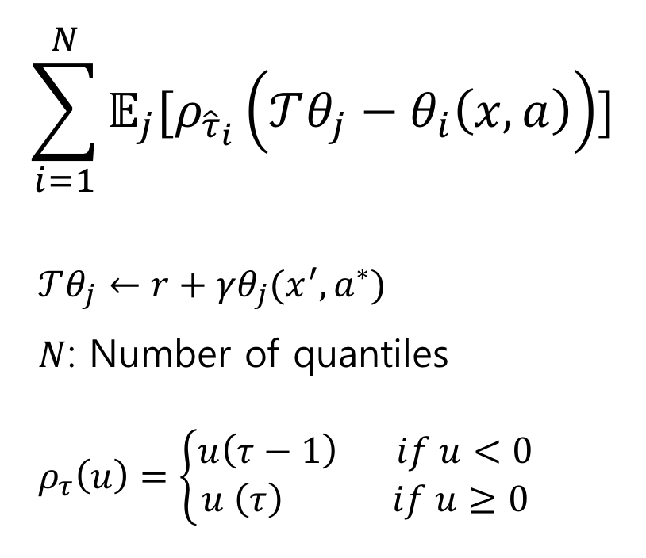

위의 식은 다음의 과정을 거쳐서 진행됩니다. 

1. Target network를 통해 구한 target support들과 network를 통해 추정한 support들의 차이를 구한다. 
   (각 target support와 추정된 support의 차이를 모두 구해야함)
2. 차이 값이 0보다 작은 경우 (1-tau)를, 0보다 크거나 같은 경우 (tau)를 곱해준다. 
3. 해당 결과를 target에 대해서는 평균을 (E), prediction에 대해서는 sum을 해주어 최종 loss를 도출   

 

위의 과정만 봤을때는 어떻게 loss를 구해야 될지 직관적으로 이해되지 않을 수 있기 때문에 한번 예시를 들어보도록 하겠습니다. 

Target supports가 [2, 4, 8, 9]이고 추정된 support가 [1, 4, 5, 8]이라고 해보겠습니다. 예시를 위한 값들을 이용하여 위의 1, 2, 3 과정을 순서대로 살펴보겠습니다. 

우선 **과정 1**의 경우, 먼저 target support와 추정된 support 각각 모든 값에 대해 차이를 구해야합니다. 이를 구현하기 위해 target support와 추정된 support를 각각 다른 축으로 쌓아서 matrix의 형태로 만든 다음에 빼주도록 하겠습니다. 위 내용을 아래와 같이 표현할 수 있습니다. 

 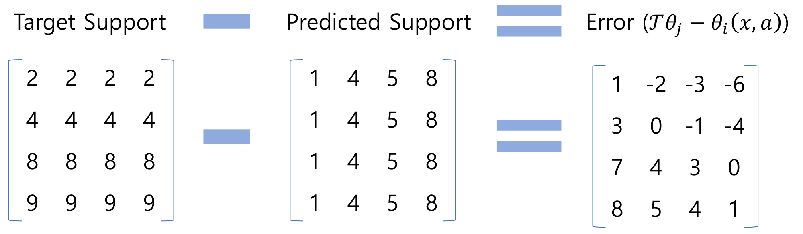

현재 quantile의 수는 4이므로 tau = [0.25, 0.5, 0.75, 1]이고 해당 tau의 중앙값들은 [0.125, 0.375, 0.625, 0.875] 입니다. 

Quantile regression loss 중 **과정 2**에 해당하는 부분이 다음과 같습니다. 

 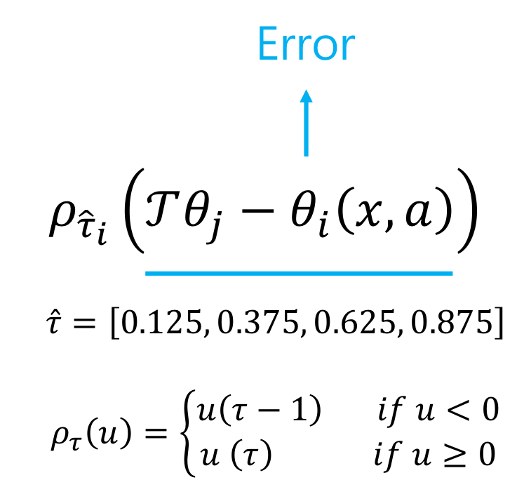

Error의 각 column에 해당하는 quantile의 중앙값들을 나타낸 것이 아래의 그림과 같습니다. 

 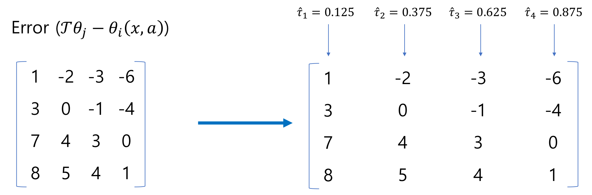

이제 과정 2의 연산을 수행한 결과가 아래의 그림과 같습니다. 

 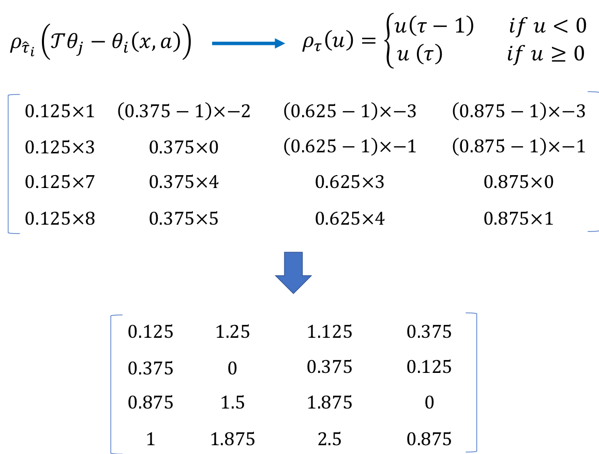

이제 **과정 3**에 해당하는 부분을 살펴보도록 하겠습니다. 

 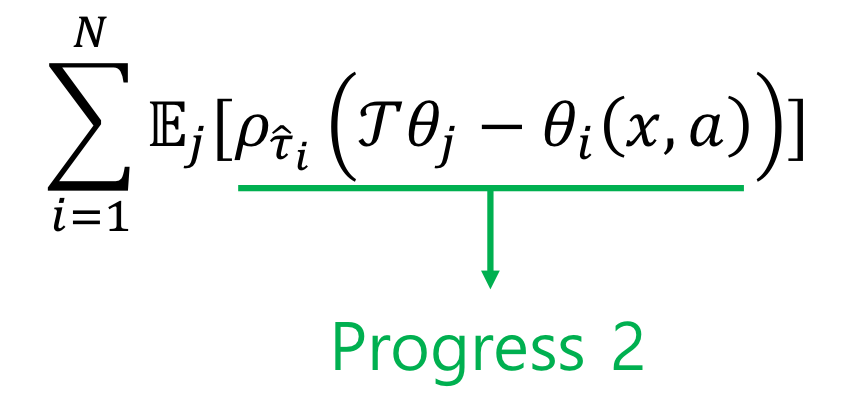

과정 3에서는 과정 2를 제외한 나머지 부분, 즉 **j (target)**에 대해서 평균하고 **i (prediction)**에 대해서 더해주는 부분에 대한 연산만 수행해주면 됩니다. 다음에 살펴볼 논문인 IQN에서는 위의 식을 아래와 같이 표현하기도 합니다. 

 

 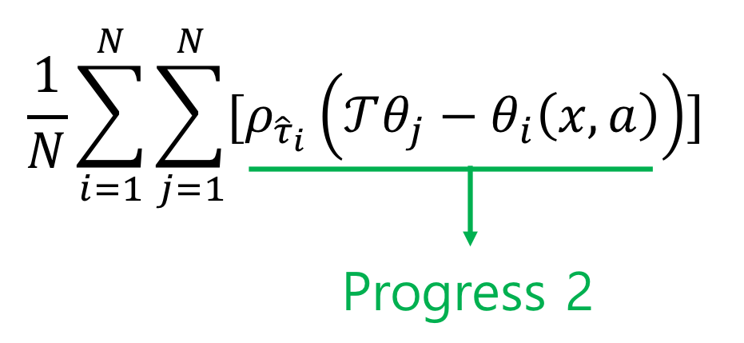

이는 과정 2를 통해 구한 matrix의 row들에 대해서는 평균을, column들에 대해서는 sum을 해주면 됩니다. 

해당 연산의 결과가 아래와 같습니다. 

 

 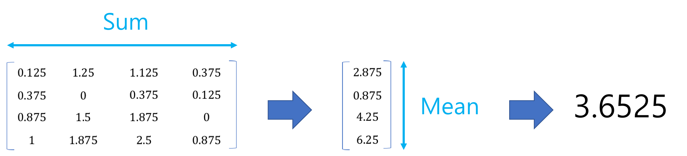

위와 같이 최종적으로 구한 Quantile regression loss가 3.6525 입니다!! 

 

그렇다면 Quantile regression loss를 이용하면 어떻게 cdf가 단조증가할 수 있게 support를 추정하게 되는 것일까요? 바로 낮은 quantile이 높은 support를 추정하거나, 높은 quantile이 낮은 support를 추정하는 경우 더 penalty를 많이 줘서 loss의 값이 커지도록 하는 것입니다. 

이 경우 또한 예를 들어 설명해보도록 하겠습니다. 위에서 들었던 예시와 동일하게 Target support가 [2,4,8,9]이고 predicted support가 아래와 같이 두 경우일때를 비교해보겠습니다. 

1. [2, 4, 8, 3]
2. [2, 4, 8, 15]

1과 2의 경우 마지막 추정된 support 이외에는 모두 target값과 동일합니다. 그리고 마지막으로 추정된 support는 target support와 비교했을 때 그 오차의 크기가 6으로 동일합니다. 하지만 **quantile regression의 입장에서는 1번의 경우 2번보다 문제가 큽니다.** 왜냐하면 큰 quantile에 대한 support값이 상대적으로 매우 작은 값을 추정했기 때문입니다. 위의 두 경우에 대한 quantile regression loss 계산 결과는 다음과 같습니다. 

 

 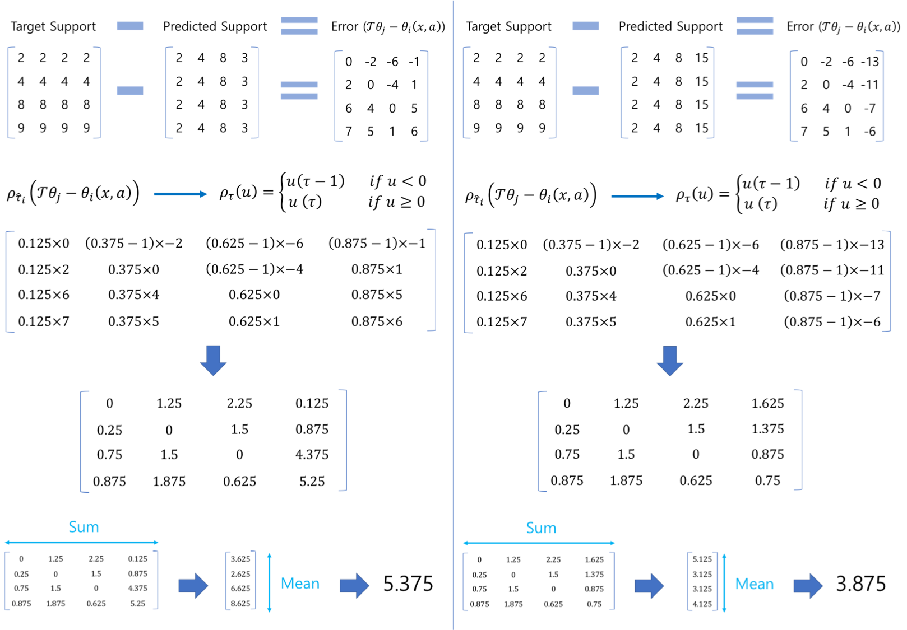

위의 결과 중 왼쪽이 predicted support = [2, 4, 8, 3] 일때, 오른쪽이 predicted support = [2, 4, 8, 15] 일 때 입니다. Quantile값 [0.25, 0.5, 0.75, 1] 중 가장 큰 quantile값인 1에 해당하는 support가 작게 나온 경우 quantile huber loss의 값이 더 크게 도출되었습니다!! 이런 차이를 만들어 낸 것은 위의 비교 중에서 다음에 해당하는 부분입니다. 

 

 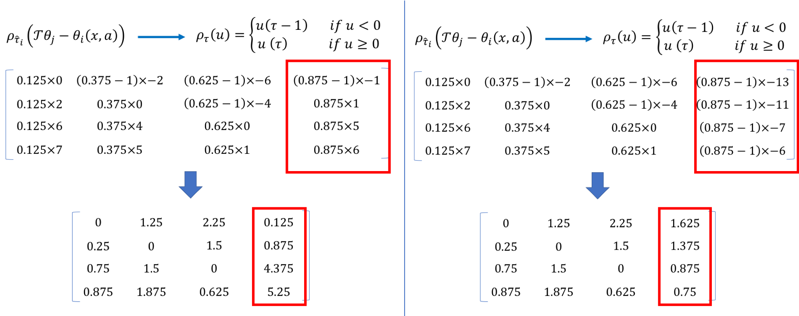

위 부분에서 볼 수 있듯이 높은 quantile에 대해서 낮은 support값을 추정하는 경우 error (u)가 대부분 양수인 것을 확인할 수 있습니다. 가장 마지막 support에 대해서 u가 0보다 크거나 같은 경우 곱해지는 tau값은 0.875입니다. 반대로 u가 0보다 작은 경우 곱해지는 값은  (1-tau)인 0.125입니다. 

이렇게 높은 quantile에 대한 support가 낮은 값을 추정하는 경우 위와 같은 연산 때문에 penalty가 생기게 되고 loss를 줄이는 방향으로 학습하다보면 높은 quantile에 대한 support가 다른 support들에 비해 높은 값을 추정할 수 있도록 학습되는 것입니다!! 위의 예시는 낮은 quantile에 대한 support가 높은 값을 추정하는 경우에도 유사하게 적용할 수 있습니다. 

위의 과정을 통해서 낮은 quantile에 대해서는 낮은 support가, 높은 quantile에 대해서는 높은 support가 추정되는 것입니다. 즉, 단조증가의 형태로 cdf를 추정할 수 있게 되는 것입니다. 

#### Quantile Huber Loss

하지만 QR-DQN 논문에서는 quantile regression loss를 그대로 이용하지 않고 **Quantile Huber Loss** 를 사용합니다. 

아래의 그림은 [Distributional RL 블로그](https://mtomassoli.github.io/2017/12/08/distributional_rl/)의 자료입니다. 

 

 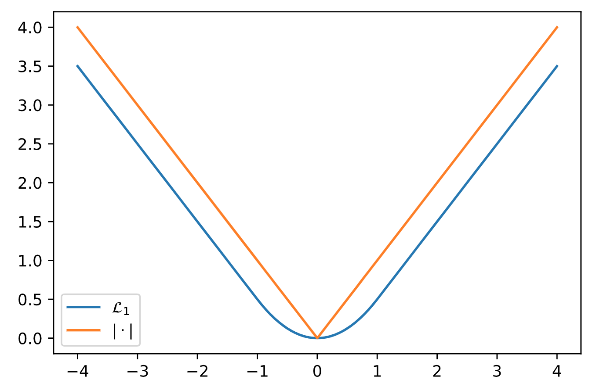

위의 결과에서 주황색선이 일반적인 quantile regression loss를 적용하였을 때 loss의 결과이며 파란색선이 Quantile huber loss를 사용하였을 때 loss의 결과입니다. Deep learning은 일반적으로 gradient를 기반으로 최적화를 수행하며 학습하는 알고리즘입니다. 하지만 quantile regression loss를 그냥 이용하는 경우 0에서 smooth하지 않아 미분이 불가능해집니다. 이런 이유로 [Huber loss](https://en.wikipedia.org/wiki/Huber_loss) 를 추가해주어 학습의 안정성을 높여줍니다. 

우선 Huber Loss의 식은 아래와 같습니다. 

 

 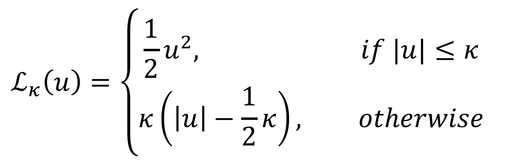

이를 이용하여 Quantile regression loss의 식 중 rho 부분을 다음과 같이 변경합니다. 

 

 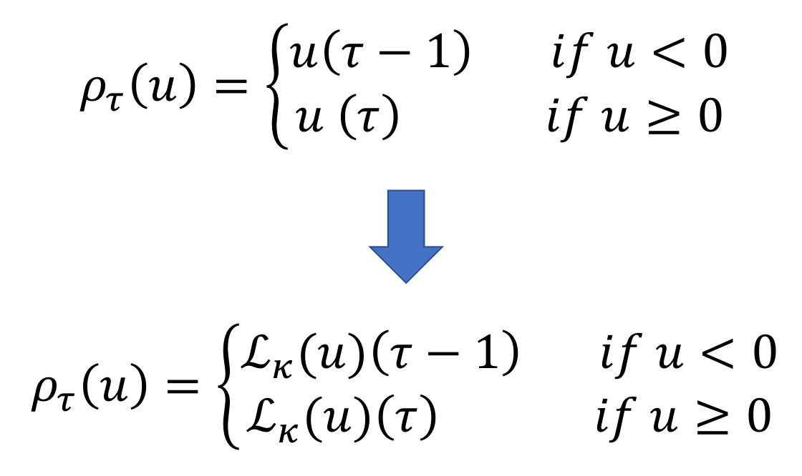

위의 부분에서 기존에는 u<0 일 때 (tau-1) 이었던 것이 (1-tau)로 바뀌었습니다. 이는 Huber loss가 적용되면서 L(u)가 0보다 커졌기 때문에 (1-tau)를 해줘야 최종적으로 loss값이 양수가 됩니다. 

Rho의 부분을 위와 같이 수정하여 최종적으로 아래와 같은 Quantile Huber Loss에 적용해주면 Quantile Huber Loss에 대한 모든 설명이 마무리됩니다!! :) 

 

 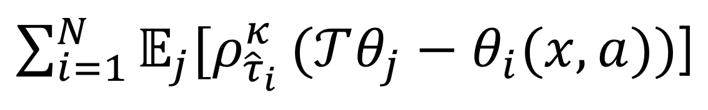

 

본 논문의 알고리즘은 다음과 같습니다. 

 

 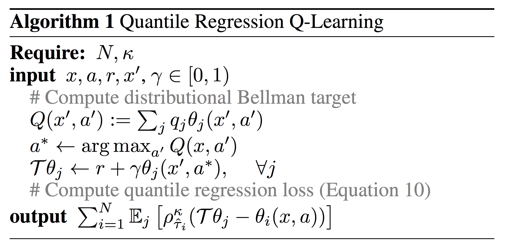

위의 알고리즘에서 볼 수 있듯이 Q-value를 계산하는 방법은 C51과 동일합니다. 

Target distribution을 계산할 때는 target network를 통해 추정한 support에 discount factor gamma를 곱하고 reward를 더하는 방식을 이용합니다. 

마지막으로 loss는 Quantile Huber Loss를 이용하여 이를 최소화 하는 방향으로 학습을 수행합니다. 

 

## Result

본 알고리즘의 성능은 다음의 두 종류의 환경을 이용하여 검증됩니다. 

- Two-room windy gridworld
- Atari 2600 games

각각의 결과에 대해 살펴보겠습니다. 

 

### Two-room Windy Gridworld

 

 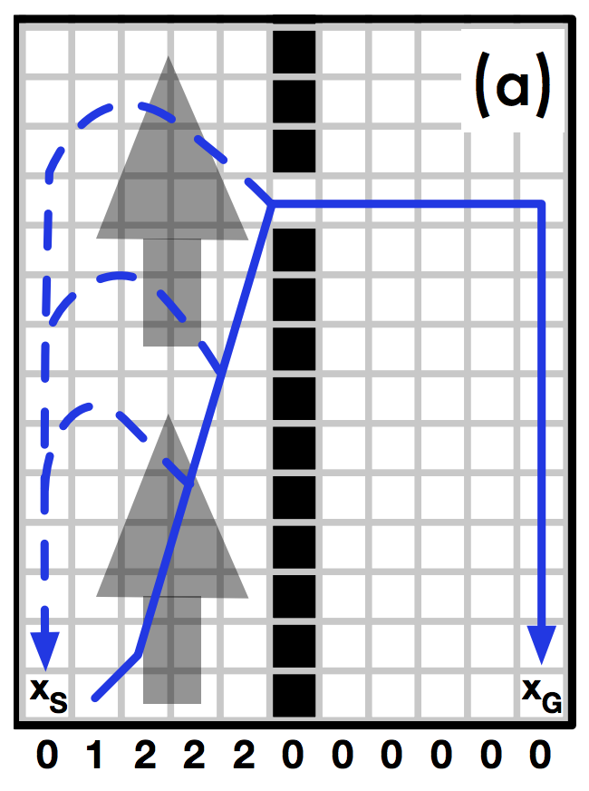

해당 환경은 확률적인 환경을 구성하기 위해 gridworld에 몇가지 장치를 추가해주었습니다. Randomness를 추가하기 위해 사용한 장치들은 다음과 같습니다. 

- Doorway
- Wind (바람이 agent를 위쪽 방향으로 밀어냄)
- Transition stochasticity (0.1 확률로 random한 방향으로 움직임)

Agent는 x_s에서 출발하며 x_G에 도달하면 1의 reward를 얻습니다. 해당 환경에서는 실제로 각 state에서 1000 step 만큼 Monte-Carlo rollout을 수행 후 직접적인 경험을 통해 확률변수를 만들어내고 QR-DQN이 이를 잘 추정하는지 검증합니다.  

 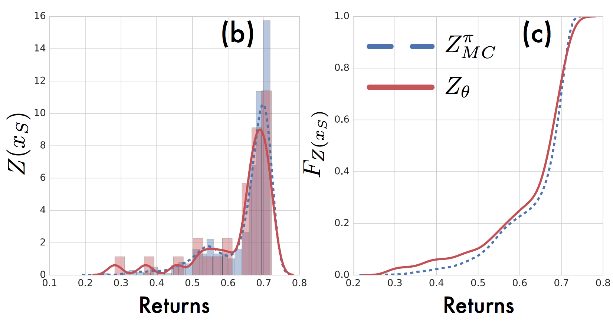

위의 결과가 Monte-Carlo rollout을 통해 구한 value distribution과 QR-DQN을 통해 추정한 value distribution간의 차이를 보여줍니다. 왼쪽의 경우 value-distribution으로, 오른쪽의 경우 CDF로 나타낸 결과입니다. 위 결과와 같이 QR-DQN은 value distribution을 실제와 유사하게 추정한다는 것을 확인할 수 있습니다. 

 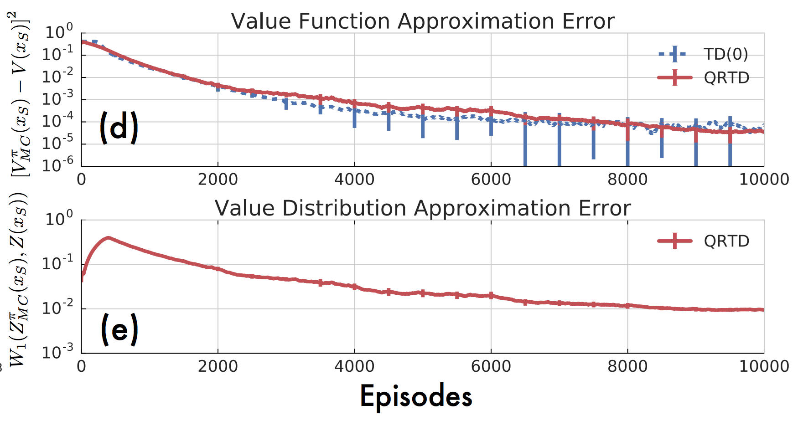

위의 결과는 Monte-Carlo rollout으로 구한 value 간 차이와 Wasserstein distance를 나타낸 그래프입니다. 위에서 볼 수 있듯이 학습이 진행될수록 Value간의 오차뿐 아니라 Wasserstein distance도 감소하는 것을 확인할 수 있습니다. 이렇게 Wasserstein distance가 줄어드는 것을 통해서 QR-DQN을 이용하는 경우 contraction 조건을 만족하며 distributional RL의 수렴성을 수학적으로 만족함을 확인할 수 있습니다. 

### Atari 2600 

Atari 환경에서 성능을 검증하기 위해 본 논문에서 설정한 파라미터들은 다음과 같습니다. 

- Learning rate = 0.00005
- Epsilon(adam) = 0.01/32
- Number of Quantiles = 200

본 논문에서는 다양한 deep reinforcement learning 알고리즘 (DQN, Double DQN, Prioritized DQN, C51) 및 Quantile huber loss의 kappa = 0, 1를 적용하였을때 결과를 비교합니다. 

 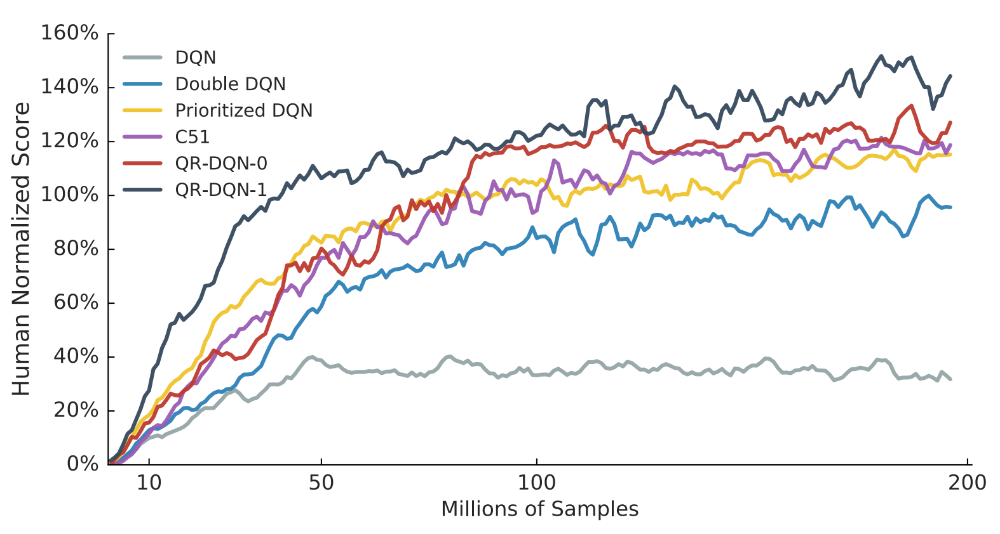

 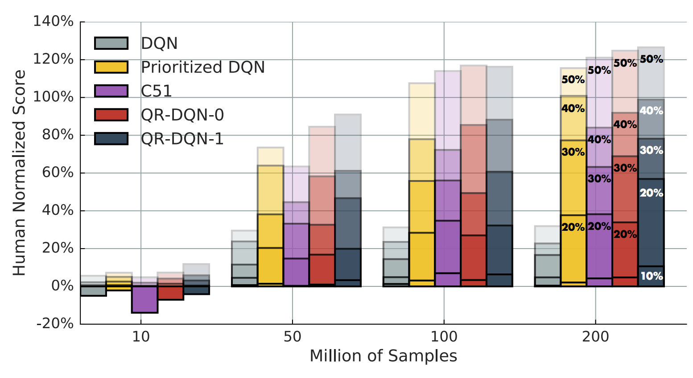

 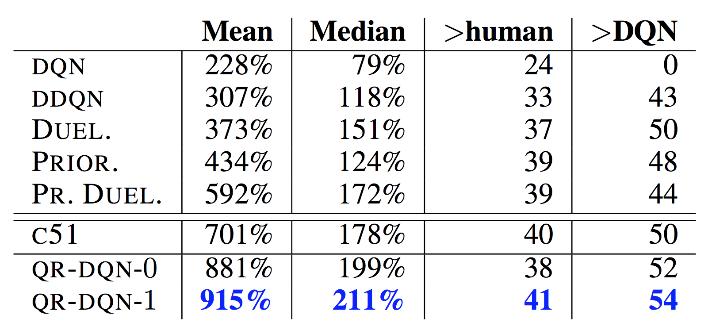

위의 결과에서 볼 수 있듯이 QR-DQN을 썼을 때, 그리고 Quantile huber loss의 kappa를 1로 하였을 때 가장 성능이 좋은 것을 확인할 수 있습니다. 

 

## Conclusion

QR-DQN의 경우 이전 논문인 C51에 비해 다음의 부분들에서 많은 개선점을 가져온 논문이라 할 수 있습니다. 

- Wasserstein distance를 줄이는 방향으로 학습을 수행하므로 distributional RL의 수렴성을 수학적으로 만족함!
- Support와 관련된 파라미터가 Quantile의 숫자 하나밖에 없음! (support의 범위 같은 것을 정할 필요 없음)
- 귀찮은 Projection 과정 생략 가능 

1.  support에 관련된 파라미터들을 결정해줘야하며 게임의 reward 범위에 따라 이 값들을 따로 설정해야 할 수 있습니다. 이런 점에 조금 귀찮은 점이 있습니다. 
2.  알고리즘에 굉장히 번거로운 projection 과정이 포함되어 있습니다. 
3.  마지막으로 해당 알고리즘의 경우 수학적으로 수렴성을 보장하지 못하는 알고리즘입니다. 

 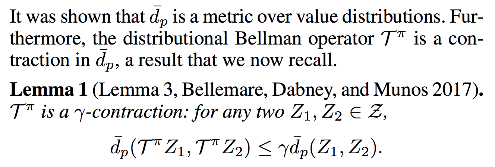

 

QR-DQN의 경우 C51 및 다양한 deep reinforcement learning 알고리즘들에 비해 좋은 성능을 보였으며 확률적인 환경에서 value distribution에 대한 추정도 매우 정확했음을 알 수 있습니다. 

다음 게시물에서는 QR-DQN 논문의 후속 논문인 [Implicit Quantile Networks for Distributional Reinforcement Learning(IQN))](https://arxiv.org/abs/1806.06923) 논문에 대해 살펴보도록 하겠습니다!!! :smile:

 

## Reference

- [Distributional Reinforcement Learning with Quantile Regression](https://arxiv.org/abs/1710.10044)

- [Blog: Distributional RL](https://mtomassoli.github.io/2017/12/08/distributional_rl/) 

- [Blog: Quantile Reinforcement Learning](https://medium.com/@fuller.evan/quantile-reinforcement-learning-56f8b3c3f134)

  ​

 

## Team

민규식: [Github](https://github.com/Kyushik), [Facebook](https://www.facebook.com/kyushik.min)

차금강: [Github](https://github.com/chagmgang), [Facebook](https://www.facebook.com/profile.php?id=100002147815509)

윤승제: [Github](https://github.com/sjYoondeltar), [Facebook](https://www.facebook.com/seungje.yoon)

김하영: [Github](https://github.com/hayoung-kim), [Facebook](https://www.facebook.com/altairyoung)

김정대: [Github](https://github.com/kekmodel), [Facebook](https://www.facebook.com/kekmodel)

