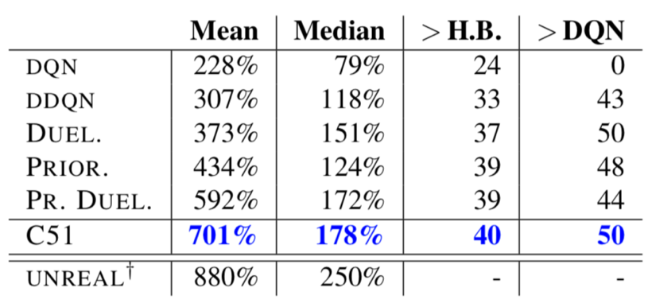

# QR-DQN
#### 먼저 읽어주세요!

[Distributional Reinforcement Learning](https://reinforcement-learning-kr.github.io/2018/09/27/Distributional_intro/)

[C51](https://reinforcement-learning-kr.github.io/2018/10/02/C51/)

#### 알고리즘 구현!

[Github Repo](https://github.com/reinforcement-learning-kr/distributional_rl/tree/master/2_CartPole_QR-DQN)

 

## Introduction

본 게시물은 2017년 10월에 발표된 논문 [Distributional Reinforcement Learning with Quantile Regression(QR-DQN)](https://arxiv.org/abs/1710.10044) 의 내용에 대해 설명합니다.

 

 

## Algorithm 

QR-DQN의 경우 C51과 비교했을 때 다음의 내용들에서 차이를 가집니다. 

- Network의 Output
- Loss

위와 같이 사실상 별로 다른 점은 없습니다. 위의 내용들에 대해 하나하나 살펴보도록 하겠습니다. 

 

### 1. Network의 Output

#### C51 vs QR-DQN

 QR-DQN의 경우도 C51과 같이 distributional RL 알고리즘입니다. 이에 따라 QR-DQN에서도 network의 output은 각 action에 대한 value distribution 입니다. C51 게시물에서 value distribution을 구성하는 것은 아래 그림과 같이 **support**와 해당 support의 **확률**, 2가지였습니다. 

 

QR-DQN과 C51의 경우 output을 구하는데 차이가 있습니다. 해당 차이를 그림으로 나타낸 것이 다음과 같습니다. 

 

즉 다음과 같은 차이가 있습니다. 

- C51: support를 동일한 간격으로 고정, network의 output으로 확률을 구함 
- QR-DQN: 확률을 동일하게 설정, network의 output으로 support를 구함 

C51의 경우 support를 구하기 위해서 다음의 parameter들을 결정해줘야 했습니다. 

- Support의 수
- Support의 최대값
- Support의 최소값

하지만 QR-DQN의 경우 network가 바로 supports를 구하기 때문에 support의 최대값이나 최소값은 정해줄 필요가 없습니다. 이에 따라 QR-DQN은 support의 수만 추가적인 parameter로 결정해주면 됩니다. QR-DQN에서 확률은 모두 동일하게 결정해주기 때문에 (1/support의 수) 로 단순하게 결정해주면 됩니다. 

#### Quantile Regression

 그럼 QR-DQN은 왜 확률은 고정하고 network를 통해 supports를 선택하는 방법을 취할까요?? 단순히 support와 관련된 parameter들의 수를 줄이기 위함은 아닙니다! 바로 QR-DQN은 **Quantile Regression**이라는 기법을 사용하기 때문입니다. Quantile regression이 무엇인지, 왜 사용하는지 한번 알아보도록 하겠습니다. 

그럼 일단 **Quantile**이 무엇인지부터 알아보겠습니다. 우선 논문에서 사용된 Quantile은 확률분포는 몇 등분 했는가를 나타냅니다. 예를 들어 4-quantiles 라고 하면 아래와 같이 확률분포를 25%씩 4등분 하게 되는 것입니다. 그리고 이때 quantile의 값들은 [0.25, 0.5, 0.75, 1]이 됩니다. 

 

 

 Quantile regression은 [Cumulative Distribution Function (CDF)](https://en.wikipedia.org/wiki/Cumulative_distribution_function)에서 적용하는 알고리즘이므로 Quantile의 예시를 CDF로 나타낸 결과가 다음과 같습니다. 

이 파트는 이렇게 풀어갈 예정 

Quantile -> Quantile regression -> Wasserstein distance를 줄일 수 있음 -> 그래서 Quantile regression을 이용한 방식으로 알고리즘을 설정 

 

### 2. Quantile Huber Loss

위에서 보셨듯이 QR-DQN은 Quantile Regression이라는 기법을 이용하여 value distribution을 정의합니다. 이에 따라 **Quantile Regression Loss**라는 특별한 loss를 이용하여 학습을 수행합니다. 우선 quantile regression loss의 목적은 다음의 2가지입니다. 

1.  Target value distribution과 네트워크를 통해 예측된 value distribution간 차이를 줄이도록 네트워크 학습 
2. 네트워크가 낮은 quantile에 대해서는 낮은 support값을, 높은 quantile에 대해서는 높은 support를 도출하도록 학습  

위의 상황에서 1의 경우 일반적인 loss의 목표입니다. Target distribution과 network를 통해 예측된 distribution간의 차이를 최소화 하도록 network를 학습시키는 것이죠. 하지만 2의 경우 quantile regression의 적용 때문에 필요한 부분입니다. 일단 2의 내용에 대해서 살펴보도록 하겠습니다. 

QR-DQN은 아래와 같이 CDF를 동일한 수의 quantile로 나누고 그때의 support를 찾는 기법입니다. 한번 예시를 들어보겠습니다. Quantile의 수가 4인 경우 중 tau=[0.25, 0.5, 0.75, 1]이 될 것이고 그 중앙값들은 [0.125, 0.375, 0.625, 0.875]가 될 것입니다. 중앙값들에 대해 network가 도출한 support들이 [1, 4, 5, 7]이라고 해보겠습니다. 위의 결과를 CDF로 나타낸 것이 아래의 그림과 같습니다. 

 

 위의 경우 정상적인 형태의 CDF입니다. 결과를 보면 tau의 중앙값 중 낮은 값들은 작은 값의 support를, 높은 값들은 큰 값의 support를 추정하여 cdf의 형태가 그 정의에 맞게 단조 증가하는 형태를 볼 수 있습니다. 

하지만 만약 위와 같은 상황에서 network가 도출한 support가 [1, **5**, **4**, 7] 이라고 생각해보겠습니다. 4와 5의 위치만 바뀌었죠? 이 결과를 CDF로 표현한 것이 아래와 같습니다. 

 

 

CDF는 확률변수 값에 따른 확률을 누적해서 더하기 때문에 확률변수 값이 커질수록 누적확률값이 커지다가 최종적으로 누적 확률이 1이 되는 **단조 증가** 특성을 가집니다. 위의 경우는 확률변수가 증가하는데 반해 누적 확률값은 오르락 내리락 하기 때문에 CDF의 기본 특성 중 하나인 단조 증가 특성을 지키지 못한 형태입니다. Quantile regression이 CDF의 역함수인데 network를 통해 구한 결과가 CDF의 기본적인 특성가지지 못한 이상한 형태로 나오면 quantile regression을 사용하는 의미가 없어지게 됩니다. 

위와 같은 이유로 network의 결과는 CDF가 단조증가 특성을 가질 수 있도록 낮은 값부터 높은 값의 순서로 도출되어야 합니다. Quantile regression loss의 경우 낮은 quantile이 높은 값의 support를 추정할수록, 혹은 높은 quantile이 낮은 값의 support를 추정할수록 큰 패널티를 주는 방식으로 설계되어 있습니다. 한번 Quantile regression loss의 식을 통해 어떻게 penalty를 주는지 한번 알아보도록 하겠습니다. Quantile regression loss의 식은 아래와 같습니다. 

 

위의 식은 다음의 과정을 거쳐서 진행됩니다. 

1. Target support들과 network를 통해 추정한 support들의 차이를 구한다. 
   (각 target support와 추정된 support의 차이를 모두 구해야함)
2. 차이 값이 0보다 작은 경우 (1-tau)를, 0보다 크거나 같은 경우 (tau)를 곱해준다. 
3. 해당 결과를 target에 대해서는 평균을 (E), prediction에 대해서는 sum을 해주어 최종 loss를 도출   

 

위의 과정만 봤을때는 어떻게 loss를 구해야 될지 직관적으로 이해되지 않을 수 있기 때문에 한번 예시를 들어보도록 하겠습니다. 

Target supports가 [2, 4, 8, 9]이고 추정된 support가 [1, 4, 5, 8]이라고 해보겠습니다. 예시를 위한 값들을 이용하여 위의 1, 2, 3 과정을 순서대로 살펴보겠습니다. 

우선 **과정 1**의 경우, 먼저 target support와 추정된 support 각각 모든 값에 대해 차이를 구해야합니다. 이를 구현하기 위해 target support와 추정된 support를 각각 다른 축으로 쌓아서 matrix의 형태로 만든 다음에 빼주도록 하겠습니다. 위 내용을 아래와 같이 표현할 수 있습니다. 

 

현재 quantile의 수는 4이므로 tau = [0.25, 0.5, 0.75, 1]이고 해당 tau의 중앙값들은 [0.125, 0.375, 0.625, 0.875] 입니다. 

Quantile regression loss 중 **과정 2**에 해당하는 부분이 다음과 같습니다. 

 

Error의 각 column에 해당하는 quantile의 중앙값들을 나타낸 것이 아래의 그림과 같습니다. 

 

이제 과정 2의 연산을 수행한 결과가 아래의 그림과 같습니다. 

 

이제 **과정 3**에 해당하는 부분을 살펴보도록 하겠습니다. 

 

과정 3에서는 과정 2를 제외한 나머지 부분, 즉 **j (target)**에 대해서 평균하고 **i (prediction)**에 대해서 더해주는 부분에 대한 연산만 수행해주면 됩니다. 다음에 볼 논문인 IQN에서는 위의 식을 아래와 같이 표현하기도 합니다. 

 

 

이는 과정 2를 통해 구한 matrix의 row들에 대해서는 평균을, column들에 대해서는 sum을 해주면 됩니다. 

해당 연산의 결과가 아래와 같습니다. 

 

지금까지의 과정을 잘 이해하셨다면 논문에 나온 아래의 알고리즘을 더 수월하게 이해할 수 있을 것입니다. 

 

 

## Result

본 알고리즘의 성능은 Atari 환경에서 검증되었으며 이때 사용한 parameters는 다음과 같습니다. 

- V(max) = 10 -> support의 최대값
- V(min) = -10 -> support의 최소값
- Epsilon (Adam) = 0.01 / (batch size) -> Adam optimizer의 epsilon 값
- Learning rate = 0.00025
- Batch size = 32

Atari 환경에서 테스트한 결과는 다음과 같습니다. 

 

위의 결과에서 볼 수 있듯이 support의 수가 많아질수록 성능은 좋아지는 편입니다. 특히 51개의 support를 이용했을 때 `SeaQuest` 게임에서 아주 좋은 성능을 보입니다. 그래서 일반적으로 이 알고리즘에서는 51개의 support를 이용하며 이에 따라 **C51**이라고 알고리즘을 부르게 되었습니다. 

 

위에서 볼 수 있듯이 sparse한 reward 환경인 Private Eye나 Venture 같은 게임에서도 다른 알고리즘들에 비해 좋은 결과를 보였다고 합니다. 

 

또한 위에서 볼 수 있듯이 DQN, DDQN, Dueling, PER, PER + Dueling 과 비교했을 때에도 매우 좋은 성능을 보입니다. 

 

마지막으로 위의 결과는 C51 vs DQN, C51 vs Human, DQN vs Human 을 했을 때 더 좋은 성능을 보인 게임의 수 입니다. 총 57개의 게임이 있으니 C51의 경우 약 절반 이상의 게임에서 사람보다 우수한 성능을 보인 알고리즘이라 할 수 있습니다. 

 

## Conclusion

C51의 경우 distributional RL 3형제 중 첫번째 알고리즘으로 distribution을 통해 value를 예측하는 알고리즘입니다. Distribution을 이용하여 value를 잘 예측하며 좋은 성능을 보이지만 이 알고리즘에서는 몇가지 아쉬운 점이 있습니다. 

1.  support에 관련된 파라미터들을 결정해줘야하며 게임의 reward 범위에 따라 이 값들을 따로 설정해야 할 수 있습니다. 이런 점에 조금 귀찮은 점이 있습니다. 
2.  알고리즘에 굉장히 번거로운 projection 과정이 포함되어 있습니다. 
3.  마지막으로 해당 알고리즘의 경우 수학적으로 수렴성을 보장하지 못하는 알고리즘입니다. 

 

Distributional RL이 수렴하기 위해서는 위와 같은 gamma-contraction 조건을 만족해야합니다. value distribution간 거리를 측정하는 distance metric (d_p)가 **Wasserstein distance**인 경우 위 조건을 **만족**하지만 **Cross entropy** 의 경우 수학적으로 위의 조건을 만족한다는 보장이 없다고 합니다. 하지만 C51 논문은 wasserstein distance를 감소시킬 방법을 찾지 못한 관계로 Cross entropy를 loss로 설정하고 이를 줄이는 방향으로 학습을 수행하는 알고리즘이기 때문에 수학적으로 distributional RL의 수렴성을 증명하지는 못하는 논문입니다. 

 

이 위의 3가지 문제점들을 해결한 논문이 C51의 후속으로 발표된 [Distributional Reinforcement Learning with Quantile Regression (QR-DQN)](https://arxiv.org/abs/1710.10044) 논문입니다. 다음 게시물에서는 이 QR-DQN 논문의 내용에 대해 살펴보도록 하겠습니다!! :smile:

 

## Reference

- [Distributional Reinforcement Learning with Quantile Regression](https://arxiv.org/abs/1710.10044)

- [Blog: Distributional RL](https://mtomassoli.github.io/2017/12/08/distributional_rl/) 

  ​

 

## Team

민규식: [Github](https://github.com/Kyushik), [Facebook](https://www.facebook.com/kyushik.min)

차금강: [Github](https://github.com/chagmgang), [Facebook](https://www.facebook.com/profile.php?id=100002147815509)

윤승제: [Github](https://github.com/sjYoondeltar), [Facebook](https://www.facebook.com/seungje.yoon)

김하영: [Github](https://github.com/hayoung-kim), [Facebook](https://www.facebook.com/altairyoung)

김정대: [Github](https://github.com/kekmodel), [Facebook](https://www.facebook.com/kekmodel)

