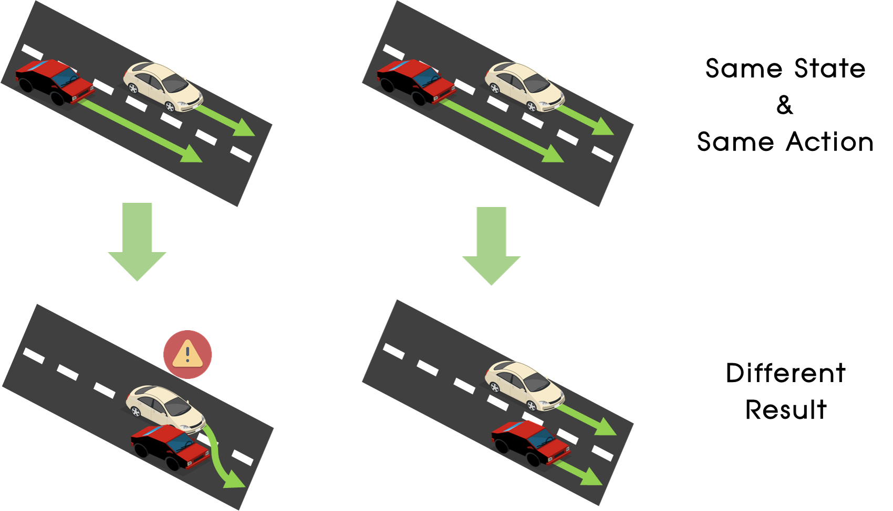
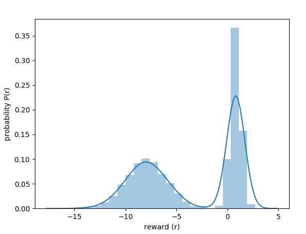

# Distributional RL
## Introduction

본 게시글은 강화학습의 한 종류 중 하나인 **Distributional Reinforcement Learning**에 대해서 설명하고 [Deepmind](https://deepmind.com/)에서 발표한 몇가지 알고리즘을 설명할 예정입니다.   

우선 일반적인 강화학습 알고리즘과 distributional RL 알고리즘을 간단하게 그림으로 비교한 것이 다음과 같습니다. 

  

일반적인 강화학습은 다양하게 task를 시도해보고 그 경험을 바탕으로 미래에 받을 평균 reward를 하나의 숫자(scalar)로 예측하도록 학습합니다. 그리고 이 예측을 통해 미래에 많은 reward를 받을 것이라 예측되는 action을 선택하게 됩니다. 

하지만!!! 환경이 **랜덤성**을 포함하고 있는 경우 상황에 따라 동일한 state에서 동일한 action을 취하더라도 다음 state에서 받는 reward가 변할 수 있습니다. 이런 상황에 대한 예시를 한번 들어보겠습니다! 아래의 경우처럼 자동차가 운전을 하고 있다고 해보겠습니다.

  

**빨간색 자동차**가 **agent** 이며 하얀색 자동차는 랜덤하게 가속, 감속, 차선변경을 하는 차량이라고 가정해보겠습니다. 이에 따라 해당 환경은 랜덤성을 포함한 환경이라 할 수 있습니다. 가장 위쪽 그림들을 보면 두 상황은 동일한 상황이고 빨간 차량은 모두 빠른 속도로 직진하는 action을 선택했습니다. 하지만 다음 state에서는 서로 다른 결과가 발생하였습니다. 왼쪽의 경우 하얀 차량이 갑자기 차선 변경을 하여 충돌이 발생하였고, 오른쪽의 경우 하얀차량이 agent보다 느린 속도로 직진하였으므로 agent가 하얀 차량을 추월하여 주행하였습니다. 

이렇게 확률적인 상황에서는 예측되는 reward를 분포로 나타내면 아래와 같이 나타낼 수 있습니다. 

  

위의 분포를 보면 확률적으로 약 1점의 reward를 받을수도, 약 -9점의 reward를 받을 수 있는 상황입니다. 확률적인 환경의 경우 상황에 따라서는 받을 확률이 높은 reward가 더 다양할 수도 있습니다. 이런 분포를 [Multimodal Distribution](https://en.wikipedia.org/wiki/Multimodal_distribution)이라고 합니다. 

이렇게 확률적인 환경에서는 하나의 숫자로 미래의 reward를 예측하는 것보다 위와 같이 분포로 미래의 reward를 예측하는 것이 더 정확한 예측이라고 할 수 있습니다. 이렇게 미래의 보상을 분포를 통해 예측하여 확률적인 환경에서 더 정확한 예측을 수행하는 강화학습 알고리즘이 바로 **Distributional Reinforcement Learning** 알고리즘입니다!! 

 

## Algorithms

최고의 AI관련 연구 기관 중 하나인 [Deepmind](https://deepmind.com/)가 최근 distributional RL에 대한 몇 가지 논문들을 발표하였으며 해당 기술들을 계속 발전시켜 다양하게 적용 중에 있습니다. 본 블로그에서 리뷰할 논문들은 다음과 같습니다. 

- [A Distributional Perspective on Reinforcement Learning (C51)](https://arxiv.org/abs/1707.06887)
- [Distributional Reinforcement Learning with Quantile Regression (QR-DQN)](https://arxiv.org/abs/1710.10044)
- [Implicit Quantile Networks for Distributional Reinforcement Learning (IQN)](https://arxiv.org/abs/1806.06923)

 

## Links

각 알고리즘들에 대한 설명은 다음의 링크들을 따라가시면 됩니다 

- [C51]()
- [QR-DQN]()
- [IQN]()

 

## Github

해당 알고리즘의 코드들은 아래의 Github에 정리되어있습니다. 

[RL Korea Distibutional RL Github](https://github.com/reinforcement-learning-kr/distributional_rl)

## Team

민규식: [Github](https://github.com/Kyushik), [Facebook](https://www.facebook.com/kyushik.min)

차금강: [Github](https://github.com/chagmgang), [Facebook](https://www.facebook.com/profile.php?id=100002147815509)

윤승제: [Github](https://github.com/sjYoondeltar), [Facebook](https://www.facebook.com/seungje.yoon)

김하영: [Github](https://github.com/hayoung-kim), [Facebook](https://www.facebook.com/altairyoung)

김정대: [Github](https://github.com/kekmodel), [Facebook](https://www.facebook.com/kekmodel)